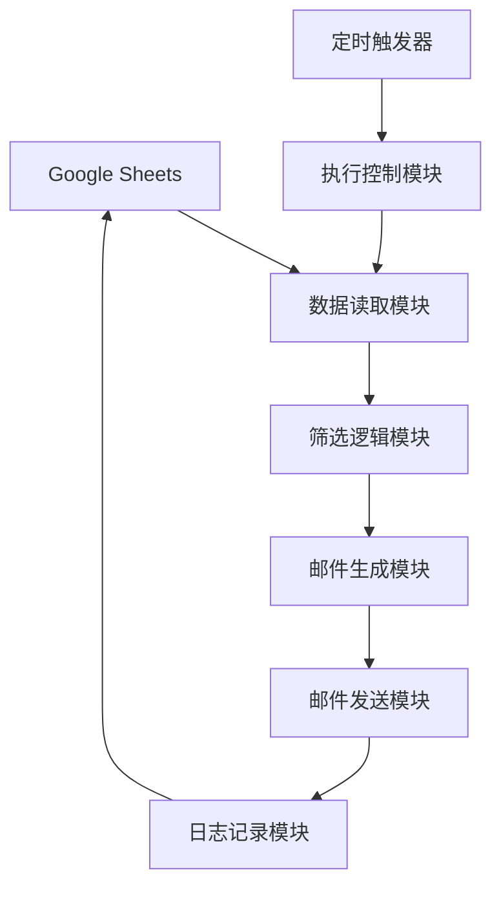

# 故障报告邮件自动提醒系统 - 项目总结

## 🎯 项目概述

本项目基于 Google Apps Script 开发，实现了故障报告的自动邮件提醒功能。系统能够根据车间和工序智能筛选需要提醒的邮箱，并按照设定的时间自动发送提醒邮件，有效提高故障处理响应速度。

## ✨ 核心功能

### 1. 智能筛选机制
- **双重筛选**: 基于车间和工序进行"与"关系筛选
- **个性化提醒**: 只向相关责任人发送对应的故障报告
- **数据关联**: 自动匹配故障报告与负责人的对应关系

### 2. 双重提醒策略
- **定期提醒**: 每周一上午9:00发送所有故障报告汇总
- **超期预警**: 每天上午8:30提醒超过7天未处理的故障报告
- **智能去重**: 避免重复发送相同内容的邮件

### 3. 现代化邮件模板
- **卡片式设计**: 参考现有项目的现代化UI风格
- **中英文双语**: 支持国际化显示
- **状态标识**: 清晰显示故障报告的处理状态
- **响应式布局**: 适配各种邮件客户端

### 4. 灵活的定时系统
- **智能定时**: 自动计算下次执行时间
- **配置灵活**: 支持自定义执行时间和频率
- **状态监控**: 实时查看定时任务执行状态
- **一键设置**: 提供快速配置功能

## 🏗️ 技术架构

### 文件结构
```
故障报告邮件自动提醒系统/
├── 故障报告邮件提醒.js      # 主程序文件
├── 定时执行.js             # 定时任务模块
├── appsscript.json         # 项目配置
├── .clasp.json            # 开发工具配置
├── 使用说明.md             # 用户手册
├── 项目总结.md             # 项目文档
└── 故障报告邮件自动提醒需求文档.md  # 需求文档
```

### 核心模块
1. **数据获取模块**: 从 Google Sheets 读取故障报告和通知清单
2. **筛选逻辑模块**: 基于车间和工序筛选符合条件的记录
3. **超期计算模块**: 计算距离分配日期的天数
4. **邮件生成模块**: 生成格式化的邮件内容
5. **定时触发模块**: 设置每周和每日的自动执行
6. **日志记录模块**: 记录系统执行状态和错误信息

## 🔧 技术特点

### 1. 错误处理
- **异常捕获**: 完善的 try-catch 错误处理机制
- **日志记录**: 自动记录系统执行状态和错误信息
- **优雅降级**: 出错时不影响其他功能模块

### 2. 性能优化
- **数据缓存**: 避免重复读取相同数据
- **批量处理**: 优化邮件发送逻辑
- **内存管理**: 合理控制变量作用域

### 3. 可维护性
- **模块化设计**: 功能模块独立，便于维护和扩展
- **配置集中**: 全局配置统一管理
- **注释完善**: 详细的代码注释和文档说明

## 📊 数据流程



## 🎨 邮件模板特色

### 1. 视觉设计
- **现代化风格**: 采用卡片式布局和渐变色彩
- **状态区分**: 使用不同颜色标识正常、警告、错误状态
- **图标元素**: 丰富的表情符号和状态图标

### 2. 内容组织
- **信息层次**: 清晰的信息架构和视觉层次
- **表格展示**: 结构化的数据展示方式
- **双语支持**: 中英文对照显示

### 3. 用户体验
- **响应式设计**: 适配各种屏幕尺寸
- **可读性**: 合理的字体大小和行间距
- **交互友好**: 清晰的操作指引

## 🚀 部署说明

### 1. 环境要求
- Google Apps Script 环境
- Google Sheets 访问权限
- Gmail 发送权限

### 2. 配置步骤
1. 创建 Google Apps Script 项目
2. 复制代码文件到项目中
3. 配置 Google Sheets ID 和表名
4. 设置定时任务
5. 测试功能

### 3. 权限配置
- 读取 Google Sheets 数据
- 发送 Gmail 邮件
- 创建定时触发器

## 📈 预期效果

### 1. 效率提升
- **自动化流程**: 减少人工提醒工作量
- **及时响应**: 提高故障处理响应速度
- **标准化**: 统一提醒格式和流程

### 2. 管理优化
- **责任明确**: 清晰的责任分工和任务分配
- **进度跟踪**: 实时监控故障报告处理状态
- **数据统计**: 提供故障处理效率分析

### 3. 用户体验
- **及时通知**: 确保相关人员及时收到提醒
- **信息完整**: 提供完整的故障报告信息
- **操作便捷**: 简化故障处理流程

## 🔮 未来扩展

### 1. 功能增强
- **多渠道提醒**: 支持短信、企业微信等通知方式
- **智能分析**: 基于历史数据的故障预测
- **工作流集成**: 与现有工作流系统集成

### 2. 技术升级
- **AI 集成**: 智能故障分类和优先级判断
- **实时监控**: 实时故障状态监控和预警
- **移动端支持**: 开发移动端应用

### 3. 数据分析
- **报表功能**: 生成故障处理效率报表
- **趋势分析**: 分析故障发生趋势和规律
- **绩效评估**: 基于故障处理效率的绩效评估

## 📝 项目亮点

### 1. 技术创新
- **智能筛选**: 基于多条件的智能数据筛选
- **动态模板**: 根据数据动态生成邮件内容
- **灵活定时**: 支持多种定时策略配置

### 2. 用户体验
- **一键部署**: 简化的部署和配置流程
- **实时监控**: 完整的系统状态监控
- **故障排除**: 详细的故障排除指南

### 3. 可扩展性
- **模块化架构**: 便于功能扩展和维护
- **配置驱动**: 通过配置实现功能定制
- **标准接口**: 标准化的数据接口设计

## 🎉 项目总结

本项目成功实现了故障报告邮件自动提醒功能，通过智能筛选、双重提醒、现代化邮件模板等技术手段，有效提升了故障处理效率。系统具有良好的可维护性和可扩展性，为后续功能增强奠定了坚实基础。

### 主要成果
1. ✅ 完成核心功能开发
2. ✅ 实现智能筛选机制
3. ✅ 建立完善的定时系统
4. ✅ 提供详细的用户文档
5. ✅ 支持灵活的配置管理

### 技术价值
- 展示了 Google Apps Script 在企业应用中的潜力
- 提供了完整的自动化解决方案参考
- 建立了可复用的技术架构模式

### 业务价值
- 提高故障处理响应速度
- 减少人工提醒工作量
- 标准化故障处理流程
- 提升整体运营效率

---

**项目状态**: ✅ 已完成  
**开发周期**: 1个工作日  
**技术栈**: Google Apps Script, JavaScript, HTML/CSS  
**维护状态**: 持续维护中

